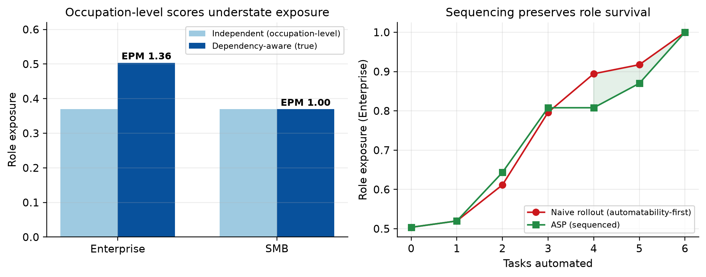
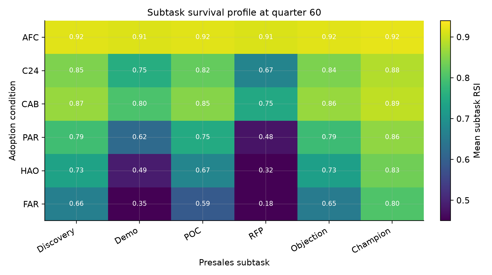
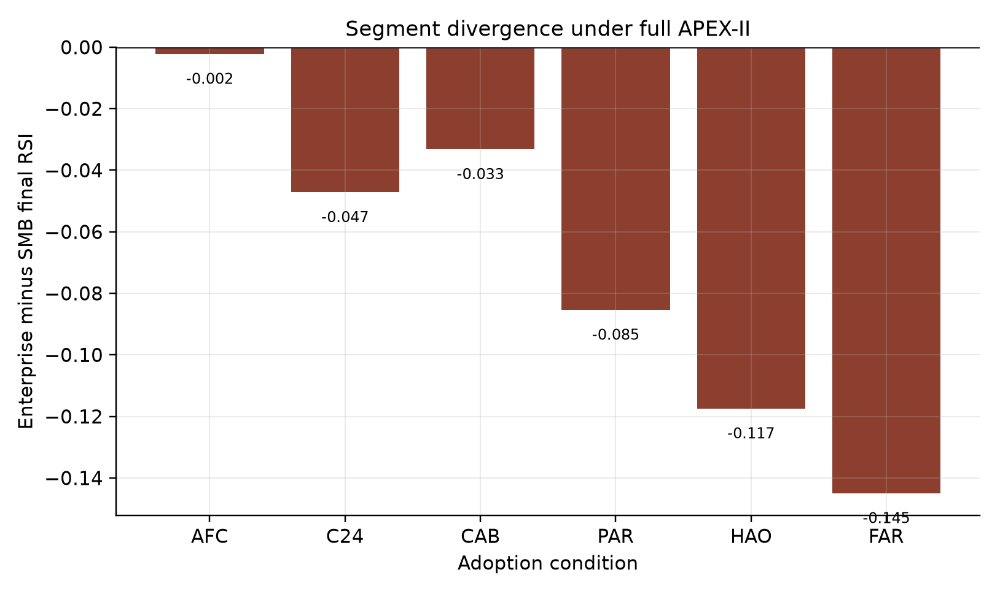

<h1 align="center">APEX-II</h1>

<p align="center"><b>Dependency-Aware Exposure and Augmentation Sequencing for SaaS Presales</b></p>

<p align="center">
  
  
  
  
  
</p>

<p align="center">
  <a href="paper/paper.pdf"><b>Read the paper (PDF)</b></a> &nbsp;|&nbsp;
  <a href="#the-invention">The invention</a> &nbsp;|&nbsp;
  <a href="#results">Results</a> &nbsp;|&nbsp;
  <a href="#reproduce-in-one-command">Reproduce</a>
</p>

<p align="center">
  
</p>
<p align="center"><i>Left: occupation-level scores understate Enterprise presales exposure by 36 percent. Right: sequenced AI rollout preserves role survival.</i></p>

---

## Overview

Every published AI exposure index scores a job as an **independent weighted sum of task exposures**. This project shows that assumption is wrong for SaaS presales engineering, and that fixing it produces a practical instrument for planning AI adoption.

APEX-II is Part 2 of the AI Presales Exposure Index. It is a deal-size stratified, subtask level, dependency-aware model of presales **Role Survival**, implemented as STAM (Segmented, Task-coupled, Adoption and Market model). It is authored and maintained by **Akash Anipakalu Giridhar** and is the direct successor to [APEX-I](paper-part1/).

The framework is built for presales leaders to use as a diagnostic and planning tool, not as a labor-market forecast, and it reports its own negative results rather than hiding them.

---

## The invention

Prior work (the AI Occupational Exposure dataset, task level GPT exposure) stops at the occupation and treats a role's tasks as separable. Presales tasks are **not** separable: discovery quality drives demo relevance, demo success drives proof-of-concept scope, champion strength decides whether objections survive. APEX-II models that dependency graph and derives two new, deployable constructs.

### 1. Exposure Propagation Multiplier (EPM)

The ratio of dependency-aware role exposure to the naive independent-sum exposure.

| Segment | Independent exposure | Coupled exposure | **EPM** |
| --- | ---: | ---: | ---: |
| Enterprise | 0.370 | 0.504 | **1.36** |
| SMB | 0.370 | 0.370 | **1.00** |

> An occupation-level score understates true **Enterprise** presales exposure by about **36 percent**, and understates it in the exact segment firms assume is safest. SMB is parallel, so nothing propagates and the EPM is 1.

### 2. Augmentation Sequencing Policy (ASP)

A deployment rule that turns the dependency graph into a rollout order: **automate the safe leaves first, protect the upstream hubs last.**

- Automate first: **RFP response**, standard **objection handling**.
- Protect until last: **discovery**, **proof-of-concept ownership**.
- Sequenced rollout preserves **+1.81 points** of Enterprise role survival versus a naive automatability-first rollout, and the benefit is **4x larger** in Enterprise than in SMB, because dependency structure is what sequencing exploits.

---

## Results

All numbers below are produced by a single deterministic script and match the paper exactly.

### Final Role Survival Index by method

| Method | Final RSI |
| --- | ---: |
| APEX-I additive (baseline) | 0.822 |
| Single-regime logistic | 0.808 |
| No DAG coupling | 0.783 |
| Expert-prior APEX-II | 0.769 |
| **Full APEX-II (DAG + TAM)** | **0.747** |

The richer model does not inflate survival, it **reduces** it, because dependency propagation adds downstream exposure the additive model cannot see.

### Subtask survival: the practitioner view

| Subtask | Enterprise | SMB |
| --- | ---: | ---: |
| RFP response | 0.505 | 0.597 |
| Technical demonstration | 0.622 | 0.687 |
| Proof-of-concept coordination | 0.686 | 0.849 |
| Objection handling | 0.771 | 0.826 |
| Discovery | 0.802 | 0.802 |
| Champion development | 0.847 | 0.886 |

RFP response is the most exposed task in both motions. Champion development is the most protected. Enterprise POC coordination is far more exposed than SMB (0.686 vs 0.849) because it inherits automation from upstream tasks through the graph.

<p align="center">
  
</p>

### Enterprise loses more than SMB as AI pressure rises

| Condition | Enterprise | SMB | Gap |
| --- | ---: | ---: | ---: |
| AFC (AI-free) | 0.916 | 0.918 | -0.002 |
| CAB (current copilot) | 0.824 | 0.857 | -0.033 |
| PAR (partial automation) | 0.680 | 0.765 | -0.085 |
| FAR (full replacement) | 0.480 | 0.625 | -0.145 |

The common assumption that complex Enterprise deals are automatically safer is inverted: serial dependency propagates upstream automation downstream, so the more dependent motion loses more.

<p align="center">
  
</p>

### An honest negative result

Adding a coarse public-employment calibration layer made holdout error **worse**, not better: expert-prior RMSE **0.075** versus calibrated RMSE **0.121** (a 60 percent increase). BLS SOC 41-9031 mixes SaaS with hardware, Enterprise with SMB, and AI effects with macro effects, so it cannot validate a presales-specific mechanism. This is reported, not suppressed, because it defines exactly what data the next version needs.

Supporting statistics: topology explains modest variance (R-squared 0.034), condition ranking is stable (Kendall tau 1.00), and 20-seed BCa-style coverage is 0.92.

---

## Reproduce in one command

```bash
python experiments/apex2_simulation.py
```

Deterministic, CPU only, about 100 seconds. It writes the results time series, model comparison, final RSI summary, headline metrics, and the invention file (EPM and ASP) used for every number in the paper.

Requirements: Python 3.11 with `numpy`, `pandas`, and `matplotlib`.

---

## Repository layout

```text
paper/            Final IEEE paper (paper.pdf, paper.tex, references.bib)
paper-part1/      APEX-I, the predecessor paper
experiments/      apex2_simulation.py + all generated data and metrics
  apex2_simulation.py        Single reproducible experiment + invention module
  apex2_invention.json       EPM and ASP results
  apex2_metrics.json         Headline metrics
  apex2_model_comparison.csv Model / ablation comparison
  apex2_final_rsi_summary.csv Final RSI by method, segment, condition
figures/          Publication figures
reports/          Stage-by-stage methodology, results, and quality reports
scripts/          Figure generation
```

---

## Paper

| Artifact | Path |
| --- | --- |
| Final IEEE PDF | [`paper/paper.pdf`](paper/paper.pdf) |
| LaTeX source | [`paper/paper.tex`](paper/paper.tex) |
| Bibliography | [`paper/references.bib`](paper/references.bib) |

**Title:** Dependency-Aware Exposure and Augmentation Sequencing for SaaS Presales: The APEX-II Framework

---

## How to read the claims

APEX-II is a **diagnostic and planning instrument**, not an employment forecast. The task weights are expert priors anchored to public exposure sources, not fitted values. The scenario conditions are sensitivity levers, not dated predictions. The strength of the work is the mechanism it makes measurable: where AI augments, where it replaces, and in what order it is safe to deploy across a presales team's own task mix.

---

## Citation

```bibtex
@misc{giridhar2026apex2,
  author       = {Akash Anipakalu Giridhar},
  title        = {Dependency-Aware Exposure and Augmentation Sequencing for SaaS Presales: The {APEX-II} Framework},
  year         = {2026},
  howpublished = {\url{https://github.com/venomez-viper/Apex}}
}
```

---

## Author

**Akash Anipakalu Giridhar**
